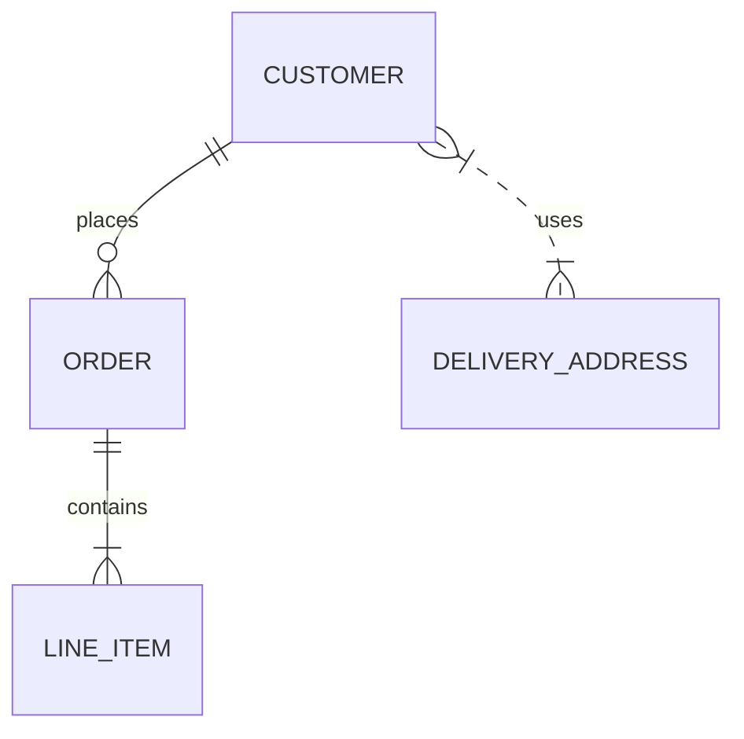

# 8. Выбор Mermaid Entity Relationship Diagrams для моделирования предметной области

Дата: 2025-09-27

## Статус
Принято

## Контекст
При проектировании новой системы необходимо документировать структуру данных и взаимосвязи между сущностями предметной области. Требуется инструмент, который позволит:
- Визуализировать сущности и связи между ними (ERD).
- Быстро создавать и редактировать диаграммы.
- Интегрироваться с существующими средствами документации (например, Markdown, Confluence, GitHub).
- Поддерживать версионирование и совместную работу над моделями.

## Решение
Выбрано использовать Mermaid Entity Relationship Diagrams (ERD) для моделирования предметной области.

Причины выбора
- Текстовая декларативная запись: Диаграммы описываются в виде кода, что упрощает версионирование и совместную работу через Git.
- Интеграция с документацией: Mermaid поддерживается в Markdown и Confluence, что позволяет встраивать диаграммы напрямую в документацию.
- Простота использования: Синтаксис достаточно простой, чтобы быстро моделировать сущности и связи без необходимости установки сложных инструментов.
- Поддержка визуализации: Mermaid генерирует визуальные диаграммы, понятные как для разработчиков, так и для бизнес-аналитиков.
- Сообщество и поддержка: Mermaid активно развивается, имеет хорошую документацию и примеры использования.

## Альтернативы
Существующие альтернативы включают:
- Draw.io / diagrams.net — визуальные диаграммы, удобные для одноразовой документации, но сложны в версионировании и интеграции с текстовыми документами.
- Lucidchart / Miro — мощные визуальные инструменты, но требуют платной подписки и ограничены интеграцией с текстовой документацией.
- PlantUML ERD — текстовый формат, удобен для версионирования, но синтаксис сложнее, меньше визуальных возможностей.
- Mermaid ERD — текстовый формат на базе Markdown, поддерживает ERD, легко интегрируется с документацией и системами контроля версий.

## Последствия
Положительные:
- Быстрая генерация и обновление диаграмм.
- Легкое версионирование и отслеживание изменений через Git.
- Возможность интеграции с существующей документацией без установки дополнительных визуальных редакторов.

Отрицательные:
- Ограниченные визуальные возможности по сравнению с Drag-and-Drop редакторами.
- Требуется знание синтаксиса Mermaid

## Примеры использования
Простейший пример ERD в Mermaid:

- ||--o{ — связь один ко многим.
- }|..|{ — связь многие ко многим.
## Заключение

Использование Mermaid ERD обеспечивает баланс между удобством визуализации, интеграцией с документацией и возможностью версионирования. Для задач моделирования предметной области выбран подход «код-диаграмма», который упрощает поддержание актуальности моделей и совместную работу команды.