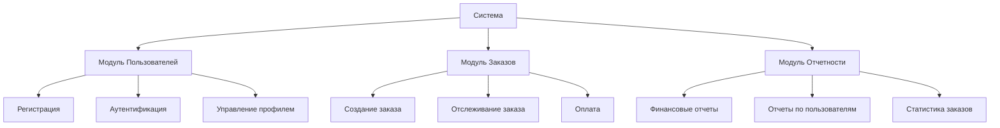

# 9. Выбор Mermaid Flowcharts для описания функциональной декомпозиции

Дата: 2025-09-27

## Статус
Принято

## Контекст
Проект требует визуального представления функциональной декомпозиции системы для улучшения понимания процессов и взаимодействий между компонентами. 
Требуется инструмент, который:
- Позволяет быстро создавать схемы.
- Легко интегрируется с документацией (Markdown, Confluence, GitHub).
- Поддерживает версионирование вместе с кодом.
- Прост в обучении для команды.

## Решение
Выбрали Mermaid Flowcharts https://mermaid.js.org/syntax/flowchart.html как основной инструмент для визуализации функциональной декомпозиции.

Причины выбора:
- Простота и читаемость: Mermaid использует текстовый синтаксис для генерации диаграмм, что облегчает понимание и редактирование.
- Интеграция с Markdown: Можно хранить схемы прямо в Markdown-документации, что упрощает сопровождение и версионирование через Git.
- Поддержка разных типов диаграмм: Помимо flowcharts, Mermaid поддерживает sequence, Gantt, class diagrams и др., что делает его универсальным.
- Автоматическая генерация: Возможность генерировать диаграммы из текстовых описаний упрощает обновление при изменении функционала.
- Открытость и поддержка: Инструмент свободно доступен, активно поддерживается сообществом и интегрируется с популярными платформами (VSCode, GitHub, Confluence).

## Альтернативы:
- Draw.io / diagrams.net – визуальный редактор, сложнее для версионирования и требует отдельного файла для каждой схемы.
- PlantUML – также текстовый синтаксис, но синтаксис сложнее и менее читаем для простых flowcharts.
- Lucidchart / Miro – удобные визуальные редакторы, но платные и менее удобны для интеграции с кодовой базой.

## Последствия:

- Диаграммы будут храниться вместе с документацией в текстовом формате.
- Обновление схем станет частью процесса сопровождения функционала.
- Требуется обучение команды базовому синтаксису Mermaid (достаточно 1–2 часов).

## Примеры использования
Простейший пример Flowcharts в Mermaid:

## Заключение:
Mermaid Flowcharts выбран как оптимальный инструмент для описания функциональной декомпозиции благодаря простоте, интеграции с Markdown, поддержке версионирования и активному сообществу.

