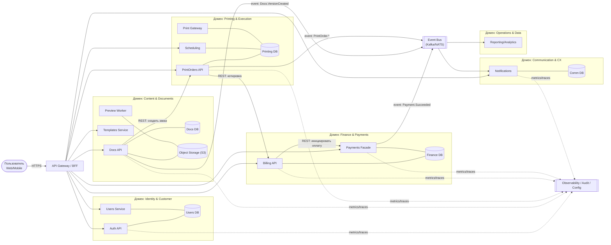

# 10. Выбор модели функциональной декомпозиции — Service-Oriented Architecture (SOA)

Дата: 2025-10-18

## Статус

Принято

## Контекст

Платформа объединяет несколько взаимосвязанных бизнес-функций:

- создание, редактирование и хранение документов; 
- заказ и исполнение печати; 
- управление платежами, тарифами и финансами; 
- коммуникации и уведомления клиентов; 
- аналитика, аудит, конфигурация и управление.

Количество пользователей — от тысяч до потенциально миллионов.
Бизнес ожидает гибкость, модульность и масштабирование, но без избыточных затрат на DevOps-инфраструктуру и координацию команд.

Необходимо выбрать архитектурную модель функциональной декомпозиции системы:
Монолит, SOA или Микросервисная архитектура (MSA).

## Решение

Выбрана модель функциональной декомпозиции в стиле Service-Oriented Architecture (SOA).

>Домены определяются как бизнес-подсистемы (bounded contexts),
каждая из которых объединяет несколько сервисов с чёткими контрактами и собственными данными (SSOT).

>Взаимодействие между доменами осуществляется через формализованные API и события (Event Bus).
Инфраструктурные функции — аутентификация, наблюдаемость, конфигурация — предоставляются общими сервисами (platform services).

## Обоснование

Бизнес-факторы
- Домены SOA напрямую отражают бизнес-направления (Content, Printing, Finance).
- Легче масштабировать команды и приоритизировать Roadmap по бизнес-функциям.
- Быстрая доставка и изоляция сбоев → улучшение клиентского опыта.
- Прозрачная стоимость сопровождения по сравнению с сотнями микросервисов.

Технические факторы
- Крупнозернистые сервисы обеспечивают локальную консистентность и простые транзакции.
- Явные контракты (OpenAPI, события JSON Schema/Avro).
- Централизованная инфраструктура (Gateway, Event Bus, Observability) упрощает управление.
- Возможность дальнейшей эволюции: внутри домена сервис можно разделить на микросервисы без ломки внешних интерфейсов.

Организационные факторы
- Доменные команды (stream-aligned) владеют своими подсистемами.
- Платформенная команда обеспечивает общие сервисы (Audit, Config, Monitoring).

Соответствует модели Team Topologies.

## Рассмотренные альтернативы
| Альтернатива                         | Плюсы                                                | Минусы                                                       | Причина отклонения                                  |
| ------------------------------------ | ---------------------------------------------------- | ------------------------------------------------------------ | --------------------------------------------------- |
| **Монолит**                          | Простое развёртывание, транзакционность              | Рост связности, сложно масштабировать и релизить             | Потеря гибкости при росте функций                   |
| **Микросервисная архитектура (MSA)** | Автономность сервисов, масштабируемость              | Высокий DevOps-оверход, сложное тестирование и наблюдаемость | Избыточно для текущего масштаба, дорого по владению |
| **SOA (выбранная)**                  | Баланс гибкости и управляемости, естественные домены | Требует дисциплины контрактов                                | Оптимальный компромисс для текущего этапа           |

## Последствия
Положительные:

- Ясные границы ответственности и владения данными (SSOT). 
- Возможность независимой разработки доменов. 
- Локализация сбоев и ускорение выпуска новых функций. 
- Единая инфраструктура и мониторинг.

Негативные/риски:

- Риск чрезмерной централизации (API Gateway/Bus) → требуется контроль. 
- Необходима культура контрактного управления (версионирование, обратная совместимость). 
- Возможна неравномерная нагрузка по доменам (например, Printing > Communication).

## Принципы реализации

- Домен = граница владения данными и командой.
- Контракты прежде кода: API — через OpenAPI, события — через Schema Registry.
- Sync = критичные цепочки (Docs → PrintOrders → Billing → Payments), Async = остальное.
- Идемпотентность и событийная согласованность (Outbox/Inbox).
- Сквозная наблюдаемость и бизнес-метрики (traceId, SLO/SLA).
- Эволюция без разрушения: дробление только внутри домена при росте нагрузки.

## Решение

Принять архитектурную модель функциональной декомпозиции Service-Oriented Architecture (SOA)
в качестве целевой для текущего этапа развития системы.
Доменные границы и сервисы фиксируются в архитектурном каталоге,
контракты формализуются через API Gateway и Event Bus,
переход к микросервисной модели возможен эволюционно внутри доменов.

## Краткая диаграмма
SOA functional decomposition model (домены как границы, сервисы как контейнеры, взаимодействия через API/Event Bus).

Диаграмма отражает функциональную декомпозицию в стиле SOA: домены — бизнес-подсистемы (границы), внутри них — сервисы (контейнеры). Синхронные вызовы используются для критичных пользовательских путей, асинхронные события — для уведомлений и аналитики. Платформенные сервисы (Observability/Audit/Config) — общие для всех доменов.