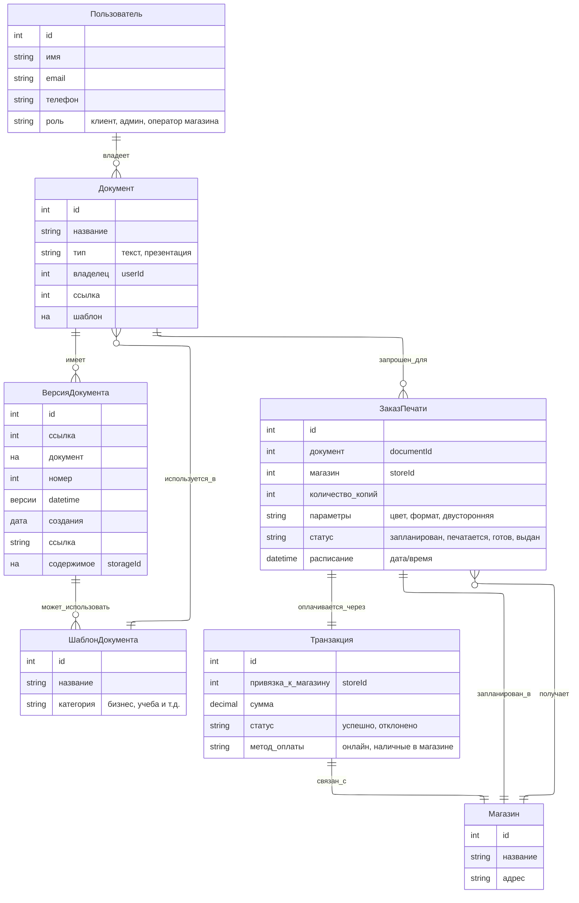
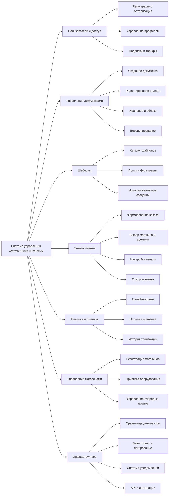
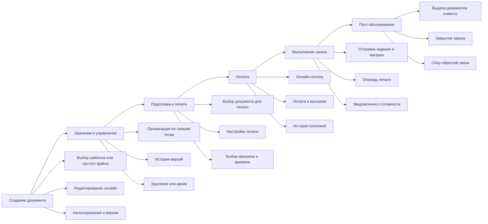
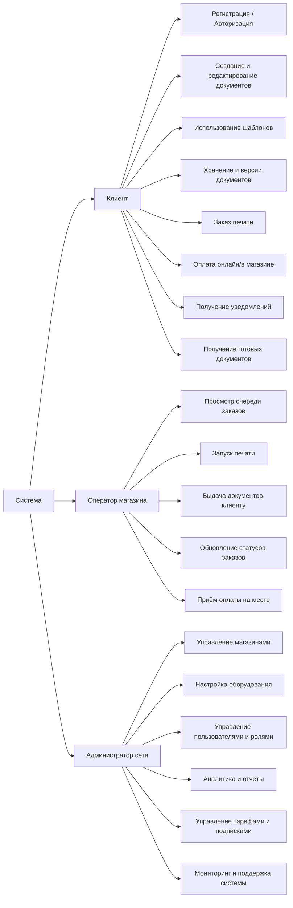

## You Look Good In Print

## 1 Модель предметной области

Основные связи:
- Пользователь → Документы (многие)
- Документ → Версии (многие)
- Документ → ЗаказПечати (многие)
- ЗаказПечати → Транзакция (1..1)
- ЗаказПечати → Магазин (1..1)
- Шаблон → используется в Документах

## 2 Функциональная декомпозиция

### 2.1 По модулям системы
#### 2.1.1 Диаграмма

#### 2.1.2 Разделим систему на подсистемы/сервисы:
A. Пользователи и доступ

- Регистрация / авторизация (OAuth, соцсети, email+пароль)
- Управление профилем
- Управление подписками и тарифами

B. Управление документами
- Создание документа (с нуля или из шаблона)
- Редактирование (онлайн редактор текста/презентаций)
- Хранение в облаке
- Версионирование (история изменений, откат)
- Совместный доступ (опционально)

C. Шаблоны
- Каталог шаблонов
- Поиск и фильтрация
- Использование как стартовой точки

D. Заказы печати
- Формирование заказа
- Выбор магазина и времени
- Настройки печати (цвет, двусторонняя, формат бумаги)
- Управление статусами заказа
- Интеграция с системой печати магазина

E. Платежи и биллинг
- Онлайн-оплата (карты, Apple Pay/Google Pay)
- Оплата в магазине (POS-терминал, наличные)
- Управление транзакциями

F. Управление магазинами
- Регистрация и настройка магазинов
- Привязка оборудования печати
- Управление очередью заказов

G. Инфраструктура
- Хранилище документов (S3 или аналог)
- Логирование и мониторинг
- Система уведомлений (email, push, SMS)
- API-шлюзы для интеграции

#### 2.1.3 Матрица модифицируемости подсистем

| Подсистема                 | Локализованность                                                                               | Зависимости (coupling)                                     | Расширяемость                                                                | Замещаемость                                                                | Частота изменений                                                                                                                                 | Интеграция                                                                  | Стоимость изменений | Пояснение                                                                                                                                                                                                                                                                                                                         |
| -------------------------- | ---------------------------------------------------------------------------------------------- | ---------------------------------------------------------- | ---------------------------------------------------------------------------- | --------------------------------------------------------------------------- |---------------------------------------------------------------------------------------------------------------------------------------------------| --------------------------------------------------------------------------- | ------------------- | --------------------------------------------------------------------------------------------------------------------------------------------------------------------------------------------------------------------------------------------------------------------------------------------------------------------------------- |
| **Пользователи и доступ**  | **Высокая** – изменения (новый способ входа) обычно ограничены auth-модулем                    | **Низкие** – опирается на стандарты (OAuth, OpenID)        | **Высокая** – легко добавить новый провайдер входа                           | **Средняя** – смена auth-провайдера может потребовать миграции схемы данных | **Средняя** -         Новые методы входа и тарифы добавляются периодически, особенно при расширении функций или интеграции с партнёрами           | **Простая** – готовые SDK и API большинства провайдеров                     | Низкая              | Изменения (новый способ входа, тарифы) ограничены auth-модулем; использует стандарты (OAuth/OpenID) → низкие зависимости; легко расширять; смена провайдера требует миграции схемы; интеграция простая с готовыми SDK; обновления происходят периодически при расширении функций.                                                 |
| **Управление документами** | **Низкая** – изменение редактора затрагивает всё ядро                                          | **Высокие** – тесно связано с хранением, версиями, печатью | **Средняя** – можно добавлять новые форматы, но дорого                       | **Низкая** – замена редактора требует глубокой перестройки                  | **Средняя–Высокая** - Периодически вводятся новые форматы файлов, улучшения редактора, совместная работа; изменения значительные, но не ежедневно | **Сложная** – интеграция с редакторами, форматами файлов и облаком хранения | Высокая             | Редактор документов связан с ядром, хранением, версиями и печатью → низкая локализованность и высокая связность; добавление новых форматов возможно, но дорого; замена редактора сложна; интеграция с редакторами и облаком сложная; изменения происходят регулярно при обновлении функций и форматов.                            |
| **Шаблоны**                | **Высокая** – изменения локализованы в каталоге                                                | **Низкие** – используется только при создании документов   | **Средняя** – легко расширить категориями, сложнее сделать маркетплейс       | **Высокая** – можно заменить хранилище или движок шаблонов                  | **Высокая** -         Часто добавляются новые шаблоны, категории, премиум-шаблоны для маркетинга и клиентского вовлечения                         | **Простая** – в основном CRUD-операции и базовый поиск                      | Низкая              | Каталог шаблонов изолирован, легко расширять новыми категориями; зависимости минимальны; можно менять хранилище; интеграция простая (CRUD); часто добавляются новые шаблоны, премиум-контент и категории.                                                                                                                         |
| **Заказы печати**          | **Средняя** – часть изменений изолирована (новые параметры печати), часть затрагивает магазины | **Средние** – связаны с документами и магазинами           | **Средняя** – новые опции печати можно добавить, но ограничены оборудованием | **Средняя** – замена подсистемы требует адаптации к принтерам               | **Средняя** -         Добавление новых форматов, оборудования или SLA происходит по мере расширения магазинов или обновления оборудования         | **Сложная** – много интеграций (оборудование, магазины, статусы заказов)    | Средняя – высокая   | Часть изменений локализована (новые параметры печати), часть затрагивает магазины; средние зависимости с документами и магазинами; расширяемость ограничена оборудованием; замена подсистемы требует адаптации; интеграция с принтерами сложная; изменения происходят по мере обновления оборудования и открытия новых магазинов. |
| **Платежи и биллинг**      | **Высокая** – изменения обычно локализованы в платёжном шлюзе                                  | **Низкие** – абстракция через фасад                        | **Высокая** – легко подключать новые платёжные методы                        | **Высокая** – при фасадном подходе можно сменить провайдера                 | **Средняя** -         Новые способы оплаты добавляются периодически, особенно с расширением на онлайн/мобильные платежи                           | **Средняя** – разные API и протоколы требуют адаптеров                      | Низкая – средняя    | Платёжный модуль изолирован; связи через фасад → низкие зависимости; легко добавлять новые методы оплаты; смена провайдера возможна через фасад; интеграция средняя (разные API); изменения происходят периодически при внедрении новых способов оплаты.                                                                          |
| **Управление магазинами**  | **Средняя** – добавление новых магазинов локализовано, но завязано на печать                   | **Средние** – связаны с заказами печати и персоналом       | **Средняя** – можно расширять модель магазинов (франшизы, SLA)               | **Средняя** – сложно заменить без влияния на заказы                         | **Низкая–Средняя** -  Изменения происходят редко: новые магазины открываются, настройки SLA меняются нечасто                                      | **Средняя** – интеграция с заказами и системой печати                       | Средняя             | Добавление новых магазинов и настройка SLA локализованы, но связаны с заказами; средние зависимости; можно расширять модель магазинов; замена сложна; интеграция средняя; изменения происходят редко.                                                                                                                             |
| **Инфраструктура**         | **Высокая** – большинство изменений локализованы (например, переход на новый storage)          | **Средние** – зависит от выбранных облачных сервисов       | **Высокая** – можно добавлять новые механизмы (нотификации, мониторинг)      | **Средняя** – смена провайдера облака требует усилий                        | **Средняя** -         Изменения происходят по мере необходимости (новое хранилище, мониторинг, нотификации), но не регулярно                      | **Сложная** – интеграция с внешними сервисами (S3, SMTP, SMS, push)         | Средняя             | Большинство изменений локализованы (новое хранилище, мониторинг); средние зависимости от облачных сервисов; легко добавлять новые механизмы; смена провайдера требует усилий; интеграция сложная; изменения происходят по мере необходимости.                                                                                     |

### 2.1.4 Анализ по характеристикам
Анализ локализованности
- Высокая: Пользователи и доступ, Шаблоны, Платежи и биллинг, Инфраструктура
→ изменения ограничены одним модулем, низкий риск затронуть другие подсистемы.
- Средняя: Заказы печати, Управление магазинами
→ изменения частично локализованы, частично зависят от других модулей.
- Низкая: Управление документами
→ изменения затрагивают ядро, сложно изолировать.

Анализ зависимостей (coupling)
- Низкие зависимости: Пользователи и доступ, Шаблоны, Платежи
→ легко модифицировать без влияния на другие подсистемы.
- Средние: Заказы печати, Управление магазинами, Инфраструктура
→ нужно учитывать интеграции, возможны дополнительные изменения.
- Высокие: Управление документами
→ любое изменение затрагивает хранение, версии и печать.

Расширяемость
- Высокая: Пользователи и доступ, Платежи и биллинг, Инфраструктура
→ легко добавить новые функции без глобальных изменений.
- Средняя: Шаблоны, Заказы печати, Управление документами, Управление магазинами
→ новые функции возможны, но могут потребовать значительных усилий.

Замещаемость
- Высокая: Шаблоны, Платежи и биллинг
- Средняя: Пользователи и доступ, Заказы печати, Управление магазинами, Инфраструктура
- Низкая: Управление документами

Частота изменений
- Высокая частота: Шаблоны.
- Средняя: Пользователи и доступ, Управление документами, Заказы печати, Платежи и биллинг, Инфраструктура.
- Низкая: Управление магазинами.

Интеграция
- Простая: Пользователи и доступ, Шаблоны
- Средняя: Платежи и биллинг, Управление магазинами
- Сложная: Управление документами, Заказы печати, Инфраструктура

### 2.1.5 Оценка и стоимость изменений
- Низкая: Пользователи и доступ, Шаблоны, Платежи и биллинг
- Средняя: Заказы печати, Управление магазинами, Инфраструктура
- Высокая: Управление документами

### 2.2.6 Выводы
«Гибкие» и дешёвые процессы
- Пользователи и доступ, Платежи и биллинг, Шаблоны – изменения можно вносить быстро и безопасно, добавлять новые функции, интегрировать с минимальными рисками.

Средняя гибкость
- Управление магазинами и Инфраструктура – требуется работа с интеграциями и адаптерами, но ядро системы не затрагивается.

«Жёсткие» и дорогие процессы
- Управление документами – самая низкая модифицируемость и высокая стоимость изменений. Любые изменения (новые форматы, редактор, версионирование) требуют значительных ресурсов и времени.
- Заказы печати – средняя модифицируемость и средняя стоимость; изменения ограничены интеграцией с оборудованием и магазинами.

### 2.2.7 Рекомендации
- Сконцентрироваться на модульной архитектуре для управления документами и заказами печати: выделение отдельных сервисов, адаптеров, API.
- Использовать готовые редакторы и платёжные фасады, чтобы снизить стоимость изменений.
- Планировать изменения так, чтобы критические модули (документы, печать) имели хорошие тесты, CI/CD и возможность поэтапного развертывания.

### 2.2 По жизненному циклу документа
#### 2.2.1 Диаграмма

Функциональна декомпозиция по сквозным процессам, через которые проходит пользователь и его документ

По итогу мы можем проектировать архитектуру сразу с учётом end-to-end сценариев, а не только технических модулей.

### 2.2.2 Описание
1. Создание и подготовка документа
    - Выбор шаблона или пустого файла
    - Редактирование онлайн
    - Автосохранение и версии

2. Управление и хранение
    - Организация документов по папкам/тегам
    - История версий
    - Удаление или архивация

3. Подготовка к печати
    - Выбор документа для печати
    - Настройка параметров печати (формат, цвет, копии, двусторонность)
    - Выбор магазина и времени печати

4. Оплата
    - Онлайн-оплата (карты, Apple Pay, Google Pay)
    - Оплата в магазине (POS, наличные)
    - Интеграция с биллинговой системой
    - Выставление и хранение чеков

5. Выполнение заказа
    - Отправка задания в магазин
    - Очередь печати (приоритизация заказов)
    - Мониторинг статуса печати (печатается → готово → выдано)
    - Уведомление клиента о готовности

6. Пост-обслуживание
    - Получение клиентом документов
    - Обновление статуса заказа (закрыт)
    - Сбор обратной связи (оценка сервиса, NPS)
    - Возможность повторного заказа (печать тех же файлов без повторной загрузки)

### 2.2.3 Матрица модифицируемости подсистем

| Процесс                                | Локализованность                                                                        | Зависимости                                  | Замещаемость                                                  | Частота изменений                                         | Интегрируемость                                   | Расширяемость                                                                                              | Стоимость изменений | Пояснение                                                                                                                                  |
| -------------------------------------- | --------------------------------------------------------------------------------------- | -------------------------------------------- | ------------------------------------------------------------- | --------------------------------------------------------- | ------------------------------------------------- | ---------------------------------------------------------------------------------------------------------- | ------------------- | ------------------------------------------------------------------------------------------------------------------------------------------ |
| **1. Создание и подготовка документа** | **Средняя/Высокая** — изменения в редакторе в основном локальны, но связаны с хранением | **Средние** — завязано на хранилище и версии | **Средняя** — редактор можно заменить, но формат ограничивает | **Высокая** — шаблоны и новые функции добавляются часто   | **Низкая** — интеграций мало                      | **Высокая** — легко добавить новые шаблоны, плагины редактора (если модульная архитектура)                 | Средняя             | Изменения часто касаются UX, но при хорошей архитектуре (плагины) редактор изолируем. Главная проблема — сильная связь с версионированием. |
| **2. Управление и хранение**           | **Низкая** — любое изменение затрагивает все процессы                                   | **Высокие** — центральный узел системы       | **Низкая** — смена хранилища трудна                           | **Средняя** — изменения из-за регуляторики                | **Средняя** — интеграция с облачными провайдерами | **Низкая/Средняя** — расширение возможно (например, теги, шаринг), но требует затрагивания многих частей   | Высокая             | Ядро системы: любое изменение затрагивает создание, печать, версионирование. Замещаемость слабая из-за сильной связанности.                |
| **3. Подготовка к печати**             | **Высокая** — новые опции локальны                                                      | **Средние** — связь с оплатой и заказами     | **Высокая** — новые параметры можно добавлять конфигурацией   | **Высокая** — бизнес часто вводит новые опции             | **Средняя** — интеграция с системой печати        | **Высокая** — легко расширять (новые форматы бумаги, настройки печати)                                     | Средняя             | Хорошо модифицируется, если интерфейсы печати унифицированы. Риск — сильная связность с выполнением заказа.                                |
| **4. Оплата**                          | **Высокая** — новый метод оплаты внедряется локально                                    | **Низкие** — связь только с заказами         | **Высокая** — легко менять шлюзы при наличии абстракции       | **Высокая** — новые методы появляются часто               | **Высокая** — множество внешних API               | **Высокая** — новые провайдеры подключаются через адаптеры                                                 | Низкая/Средняя      | Очень модифицируемый блок, если использовать платежный gateway abstraction (например, Stripe/Adyen).                                       |
| **5. Выполнение заказа**               | **Средняя** — изменения часто затрагивают интеграции                                    | **Высокие** — зависит от оборудования        | **Низкая/Средняя** — разные API у принтеров                   | **Средняя** — новые точки обслуживания, очереди           | **Высокая** — интеграция с «железом» и магазинами | **Средняя** — можно расширять (новые статусы, типы магазинов), но сложно из-за зависимости от оборудования | Средняя/Высокая     | Сложный блок: зависит от «железа» и внешних API. Изменения требуют больших усилий.                                                         |
| **6. Пост-обслуживание**               | **Высокая** — изменения локальны                                                        | **Низкие** — мало связей с другими           | **Высокая** — легко менять и интегрировать                    | **Средняя** — программы лояльности, каналы обратной связи | **Средняя** — интеграции с CRM и нотификациями    | **Высокая** — легко добавлять новые функции (акции, бонусы, уведомления)                                   | Низкая              | Слабо связано с остальными процессами. Изменения локализованы и легко внедряются.                                                          |

### 2.2.4 Анализ по характеристикам
Локализованность
- Наиболее локализованные: Подготовка к печати, Оплата, Пост-обслуживание.
- Менее локализованные: Управление и хранение, Создание документа (частично из-за связи с хранилищем).

Зависимости
- Наибольшие зависимости: Управление и хранение, Выполнение заказа (влияние на многие процессы).
- Наименьшие зависимости: Оплата, Пост-обслуживание — изменения легко изолировать.

Замещаемость
- Хорошая замещаемость: Оплата, Подготовка к печати, Пост-обслуживание.
- Плохая: Управление и хранение, Выполнение заказа (тесная связь с оборудованием и ядром).

Частота изменений
- Высокая частота: Создание документа, Подготовка к печати, Оплата.
- Средняя: Управление и хранение, Выполнение заказа, Пост-обслуживание.

Интегрируемость
- Сложная интеграция: Выполнение заказа (аппаратное), Оплата (много внешних провайдеров).
- Простая интеграция: Создание документа, Пост-обслуживание.

Расширяемость
- Хорошо расширяемые: Создание документа, Оплата, Подготовка к печати, Пост-обслуживание.
- Ограниченная: Управление и хранение, Выполнение заказа.

### 2.2.5 Оценка и стоимость изменений
- Самые дорогие изменения: Управление и хранение, Выполнение заказа.
- Средняя стоимость: Создание документа, Подготовка к печати.
- Самые дешёвые изменения: Оплата, Пост-обслуживание.

### 2.2.6 Выводы
«Гибкие» и дешёвые процессы
  - Оплата и Пост-обслуживание: высокая локализованность, низкие зависимости, хорошая замещаемость и расширяемость.
  - Изменения легко внедрять, стоимость низкая.

Средняя гибкость
- Создание документа и Подготовка к печати: локальные изменения возможны, но тесная связь с другими процессами требует тестирования. Стоимость средняя.
   
«Жёсткие» и дорогие процессы
- Управление и хранение: низкая локализованность, высокая зависимость, низкая замещаемость. Любое изменение затрагивает почти всю систему → высокая стоимость.
- Выполнение заказа: интеграция с физическим оборудованием повышает зависимость и сложность. Средняя/высокая стоимость изменений.

### 2.2.7 Рекомендации
Для уменьшения стоимости изменений и повышения модифицируемости:
- Выделить Управление и хранение в отдельный сервис с чётким API и слоем абстракции.
- Использовать плагинообразный подход для редактора документов и печати.
- Сделать Выполнение заказа более абстрагированным через API между магазином и системой, чтобы снизить зависимость от железа.
- «Гибкие» модули (Оплата, Пост-обслуживание) можно расширять без риска для ядра.

### 2.3 По ролям пользователей

## 3 Сравнительный анализ

- Фокус декомпозиции 
  - По модулям системы – отражает архитектуру и технические блоки (авторизация, биллинг, инфраструктура). 
  - По жизненному циклу документа – отражает бизнес-процессы (создание → печать → оплата → пост-обслуживание). 
- Локализованность изменений 
  - В модульной модели локализованность лучше у периферийных подсистем (шаблоны, платежи, пользователи), но хуже у ядра (управление документами). 
  - В жизненном цикле локализованность лучше в процессах подготовки к печати, оплаты и пост-обслуживания, но очень низкая в управлении хранением (центральный узел). 
- Интегрируемость 
  - По модулям сложнее всего интегрируются управление документами, заказы печати и инфраструктура. 
  - По жизненному циклу наибольшая сложность у выполнения заказа (интеграция с «железом»). 
- Частота изменений 
  - В модульной декомпозиции чаще всего меняются: шаблоны, управление документами, платежи. 
  - В жизненном цикле – создание документа, подготовка к печати, оплата.
- Расширяемость 
  - Модульная модель более устойчива для подключения новых сервисов (новые шаблоны, платежи). 
  - Жизненный цикл лучше отражает добавление новых бизнес-функций (лояльность, повторные заказы, UX редактора).

1. Декомпозиция по модулям системы
- Плюсы:
  - Хорошо выделяет технологические границы (auth, редактор, биллинг, печать, инфраструктура). 
  - Удобно для проектирования микросервисов или отдельных компонент. 
  - Легко оценивать модифицируемость и интеграции на уровне подсистем.

- Минусы:
  - Менее прозрачно отражает пользовательский опыт и бизнес-процессы. 
  - Некоторые зависимости (например, «Документы» ↔ «Печать») сильно завязаны друг на друга и снижают локализованность.

2. Декомпозиция по жизненному циклу документа

- Плюсы:
  - Отражает путь пользователя «от создания документа до печати и получения». 
  - Более наглядна для бизнес-аналитики, владельцев продукта и UX-дизайнеров. 
  - Критические сценарии (создание, печать, оплата) сразу встроены в модель.

- Минусы:
  - Сильнее «централизует» хранение и управление документами — высокая связанность. 
  - Менее удобно для выделения независимых технических сервисов (например, оплата может быть просто модулем, а здесь часть цепочки).

## 4 Вывод по выбору решения
Для проектирования системы целесообразно комбинировать оба подхода:

* Декомпозиция **по модулям** лучше подходит для технической реализации (микросервисы, интеграции, независимые команды).
* Декомпозиция **по жизненному циклу документа** удобнее для анализа бизнес-ценности, проектирования UX и критических сценариев.

Таким образом, для архитектурного проектирования и разработки приоритетнее использовать модульную декомпозицию: она обеспечивает независимость сервисов, проще поддерживается и масштабируется. Для бизнес-анализа и клиентского пути логичнее использовать декомпозицию по жизненному циклу документа, так как она отражает ключевые сценарии взаимодействия пользователей с сервисом.

Итог: оптимальным решением будет гибридный подход — проектировать архитектуру через модули, но управлять приоритизацией функций и требованиями через модель жизненного цикла документа.
