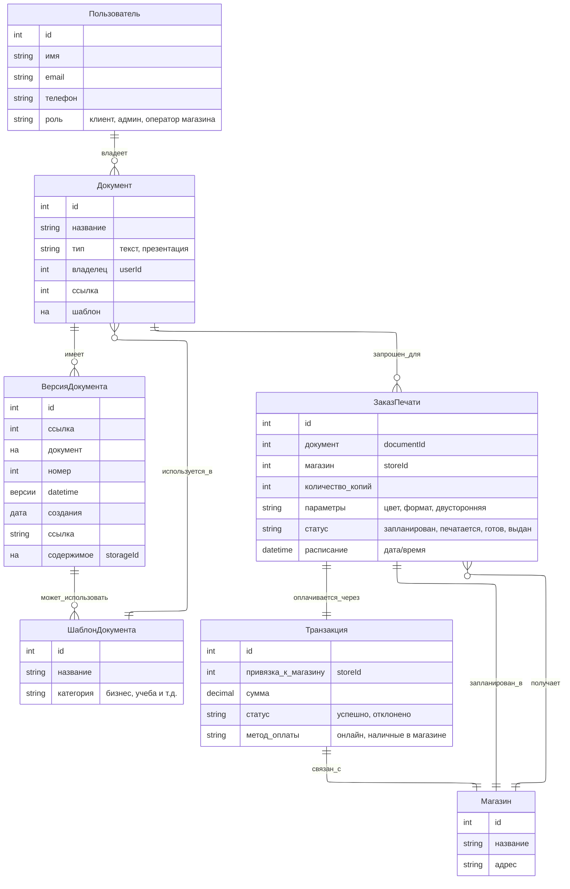
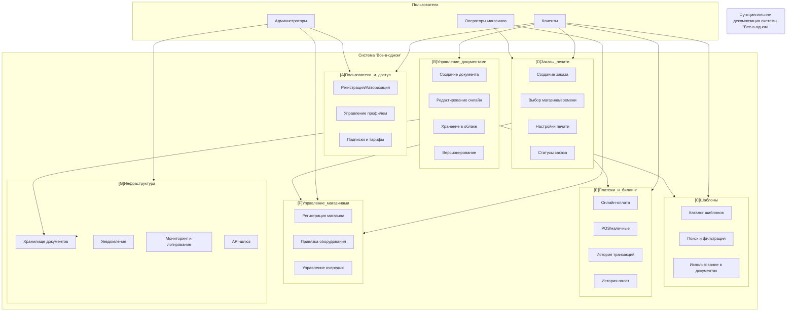

## You Look Good In Print

## 1.1 Модели предметной области
- принимаем ADR об инструменте для составления диаграмм моделей предметной области
[0008-use-mermaid-entity-relationship-diagram-for-domain-modeling.md](architecture/decisions/0008-use-mermaid-entity-relationship-diagram-for-domain-modeling.md)

- Получаем диаграмму моделей предметной области

Основные связи:
- Пользователь → Документы (многие)
- Документ → Версии (многие)
- Документ → ЗаказПечати (многие)
- ЗаказПечати → Транзакция (1..1)
- ЗаказПечати → Магазин (1..1)
- Шаблон → используется в Документах

## 1.2 Функциональная декомпозиция
- принимаем ADR об инструменте для составления диаграмм функциональной декомпозии
[0009-use-mermaid-flowcharts-for-functional-decomposition.md](architecture/decisions/0009-use-mermaid-flowcharts-for-functional-decomposition.md)
- Получаем диаграмму функциональной декомпозии

Разделим систему на подсистемы/сервисы:

A. Пользователи и доступ

- Регистрация / авторизация (OAuth, соцсети, email+пароль)
- Управление профилем
- Управление подписками и тарифами

B. Управление документами
- Создание документа (с нуля или из шаблона)
- Редактирование (онлайн редактор текста/презентаций)
- Хранение в облаке
- Версионирование (история изменений, откат)
- Совместный доступ (опционально)

C. Шаблоны
- Каталог шаблонов
- Поиск и фильтрация
- Использование как стартовой точки

D. Заказы печати
- Формирование заказа
- Выбор магазина и времени
- Настройки печати (цвет, двусторонняя, формат бумаги)
- Управление статусами заказа
- Интеграция с системой печати магазина

E. Платежи и биллинг
- Онлайн-оплата (карты, Apple Pay/Google Pay)
- Оплата в магазине (POS-терминал, наличные)
- Управление транзакциями
- История оплат

F. Управление магазинами
- Регистрация и настройка магазинов
- Привязка оборудования печати
- Управление очередью заказов

G. Инфраструктура
- Хранилище документов (S3 или аналог)
- Логирование и мониторинг
- Система уведомлений (email, push, SMS)
- API-шлюзы для интеграции

## 2. Сценарии изменений с примерами и оценкой вероятности
Сценарии изменений
1. Функциональные изменения
   1. Добавление нового типа документа (например, таблицы/sheets, как в Google Docs)
      - Вероятность: средняя
      - Влияние: расширение модели документов, обновление редактора, хранилища и версионирования.

   2. Введение совместного редактирования документов в реальном времени
      - Вероятность: средняя
      - Влияние: необходимость WebSocket/OT (Operational Transformation) или CRDT.

   3. Поддержка внешних интеграций (например, загрузка файлов из Google Drive/Dropbox)
      - Вероятность: высокая
      - Влияние: интеграция с API сторонних сервисов, безопасность OAuth.

   4. Новые опции печати (плотная бумага, ламинирование, переплёт)
      - Вероятность: высокая
      - Влияние: расширение модели заказа печати, UI и связи с магазином.
      
2. Технические изменения
   1. Рост числа пользователей с 10 тыс. до 1 млн+
      - Вероятность: высокая
      - Влияние: масштабирование архитектуры (разделение на микросервисы, шардирование БД, кеширование).
      
   2. Миграция в другой облачный провайдер (AWS → GCP/Azure)
      - Вероятность: низкая
      - Влияние: абстракция над хранилищем и сервисами, использование Kubernetes для portability.
      
   3. Поддержка оффлайн-режима в браузере (редактирование без сети, синхронизация при подключении)
      - Вероятность: средняя
      - Влияние: добавление локального хранения (IndexedDB), синхронизация версий.
      
3. Бизнес-изменения
   1. Введение премиум-тарифов (например: расширенное облачное хранилище, доступ к премиум-шаблонам)
      - Вероятность: высокая
      - Влияние: новые правила биллинга, интеграция с подписочной моделью.
      
   2. Выход в другие города/страны
      - Вероятность: средняя
      - Влияние: многомагазинная архитектура, поддержка локализации (валюта, язык, налоги).

   3. Слияние/поглощение или передача управления IT-другой компании
      - Вероятность: низкая
      - Влияние: требования к модульности, возможность API-first подхода.

Резюме по вероятности
- Высокая вероятность: рост нагрузки, новые опции печати, внешние интеграции, премиум-тарифы.
- Средняя вероятность: новые типы документов, совместное редактирование, оффлайн-режим, географическое расширение.
- Низкая вероятность: смена облачного провайдера, поглощение бизнеса.

### Таблица: сценарии изменений и архитектурные атрибуты качества

| Сценарий изменения                                            | Вероятность | Масштабируемость                                    | Модульность / расширяемость                       | Безопасность                                | UX (удобство)                      | Надёжность                         |
| ------------------------------------------------------------- | ----------- | --------------------------------------------------- | ------------------------------------------------- | ------------------------------------------- | ---------------------------------- | ---------------------------------- |
| **Новые опции печати (цвет, переплёт, ламинация)**            | Высокая     | –                                                   | Требует расширяемой модели заказов                | –                                           | Улучшение (больше выбора)          | –                                  |
| **Интеграция с внешними хранилищами (Google Drive, Dropbox)** | Высокая     | –                                                   | Модуль API-интеграций должен быть изолирован      | OAuth/авторизация, защита токенов           | Повышает удобство                  | –                                  |
| **Рост пользователей (10 тыс. → 1 млн)**                      | Высокая     | Критично: шардирование БД, балансировщики, кеш      | Микросервисы или модульный монолит                | –                                           | Важно сохранить отклик <1-2с       | Важно (устойчивость к сбоям)       |
| **Введение премиум-тарифов / подписки**                       | Высокая     | Среднее (новые тарифы не критичны для нагрузки)     | Новый модуль биллинга, интеграция с подписками    | PCI DSS / защита платежей                   | Может добавить friction при оплате | Надёжность биллинга критична       |
| **Новый тип документа (таблицы)**                             | Средняя     | Умеренное влияние (рост нагрузки на редактор)       | Требует расширяемого редактора                    | –                                           | Новая ценность для клиентов        | Версионирование нужно адаптировать |
| **Совместное редактирование в реальном времени**              | Средняя     | Требует real-time инфраструктуры (WebSockets, CRDT) | Модульность редактора + синхронизация             | Контроль доступа и прав                     | Значительный рост удобства         | Возможны конфликты версий          |
| **Оффлайн-режим (редактирование без сети)**                   | Средняя     | Локально не влияет, но синхронизация = нагрузка     | Требуется слой синхронизации (IndexedDB + сервер) | Защита данных на клиенте                    | Сильное улучшение                  | Важно избежать потери данных       |
| **Выход в новые города/страны**                               | Средняя     | Поддержка многорегиональных кластеров               | Мультиязычность, многомагазинность                | Соответствие локальным законам (GDPR и др.) | Повышает охват                     | –                                  |
| **Смена облачного провайдера (AWS → GCP)**                    | Низкая      | Возможны различия в масштабировании                 | Нужна абстракция над сервисами                    | –                                           | –                                  | Риск простоя при миграции          |
| **Передача управления IT-другой компании**                    | Низкая      | –                                                   | API-first, документация                           | Контроль безопасности при переходе          | –                                  | Риск регрессии SLA                 |

Выводы
- Ключевой драйвер изменений: рост нагрузки + новые функции для пользователей (печать, интеграции, тарифы).
- Архитектурный стиль должен быть модульный и расширяемый (поэтапно можно двигаться от модульного монолита к микросервисам).
- Критичные атрибуты для будущего: масштабируемость, модульность, безопасность платежей и данных.
- UX — основной бизнес-драйвер (лояльность).

## 3. Оценка и стоимость 
Стоимость будем оценивать условно:
- Низкая (1–2 спринта небольшой команды, минимальные доработки)
- Средняя (2–4 спринта, затрагивает несколько модулей)
- Высокая (полгода и более, сложная переработка архитектуры и UI/UX)

Таблица сценариев изменений и оценки стоимости изменений (Change Cost Estimate)

| Сценарий изменения                                          | Вероятность | Стоимость изменений | Влияние                                                              |
| ----------------------------------------------------------- | ----------- | ------------------- | -------------------------------------------------------------------- |
| **Новый тип документа (таблицы)**                           | Средняя     | **Высокая**         | Новый редактор, доработка модели данных, версионирования, API.       |
| **Совместное редактирование (реал-тайм)**                   | Средняя     | **Высокая**         | Требует CRDT/OT, WebSocket-инфраструктуры, синхронизации версий.     |
| **Интеграции с внешними сервисами (Google Drive, Dropbox)** | Высокая     | **Средняя**         | Добавление OAuth-провайдеров, импорт/экспорт, безопасность.          |
| **Новые опции печати (бумага, ламинация, переплёт)**        | Высокая     | **Низкая**          | Расширение модели заказа, UI и настройки печати.                     |
| **Рост пользователей (10k → 1M+)**                          | Высокая     | **Высокая**         | Горизонтальное масштабирование, кеши, шардирование, CDN.             |
| **Миграция в другой облачный провайдер**                    | Низкая      | **Средняя/Высокая** | Завязка на абстракции хранения и контейнеризацию, перенос данных.    |
| **Оффлайн-режим (редактирование без сети)**                 | Средняя     | **Средняя/Высокая** | Локальное хранилище (IndexedDB), синхронизация версий, UX-сложности. |
| **Премиум-тарифы (подписка)**                               | Высокая     | **Низкая/Средняя**  | Изменения в биллинге и тарифной системе, UI.                         |
| **Выход в новые города/страны**                             | Средняя     | **Средняя**         | Многомагазинная архитектура, мультиязычность, налоги/валюты.         |
| **Слияние/передача IT другому провайдеру**                  | Низкая      | **Средняя/Высокая** | Требует API-first, контрактной архитектуры, документации.            |

## 4. Сравнительный анализ и вывод
Сравнительный анализ сценариев
1. По вероятности
   - Высокая вероятность:
     - рост пользователей, 
     - новые опции печати, 
     - интеграции с внешними сервисами, 
     - премиум-тарифы. 
     → Эти изменения почти наверняка произойдут.

   - Средняя вероятность:
     - новые типы документов, 
     - совместное редактирование, 
     - оффлайн-режим, 
     - географическое расширение. 
     → Возможны в среднесрочной перспективе.

   - Низкая вероятность:
     - миграция в другой облачный провайдер, 
     - слияния/поглощения. 
     → Сценарии из разряда «форс-мажор».

2. По стоимости 
   - Низкая/Средняя стоимость:
     - новые опции печати, 
     - премиум-тарифы, 
     - интеграции с внешними сервисами. 
     → Лёгкие доработки с высокой ценностью для бизнеса. 
   - Средняя/Высокая стоимость:
     - оффлайн-режим, 
     - географическое расширение, 
     - миграция в облако, 
     - организационные изменения. 
   - Высокая стоимость:
     - новый тип документа (таблицы), 
     - совместное редактирование, 
     - масштабирование до миллионов пользователей. 
     → Требуют серьёзной архитектурной закладки.

3. По влиянию на архитектурные атрибуты
   - Масштабируемость: рост пользователей → критически важно заложить с начала. 
   - Расширяемость: новый тип документа и опции печати → должны быть поддержаны через модульность. 
   - Интегрируемость: внешние сервисы и магазины → важен API-first. 
   - Надёжность и консистентность: совместное редактирование и оффлайн-режим → сложные сценарии, требующие продуманной синхронизации.

Вывод
1. Быстрые победы (высокая вероятность + низкая стоимость):
   - добавить новые опции печати, 
   - реализовать премиум-тарифы, 
   - сделать интеграцию с Google Drive/Dropbox. 
   → Они сразу повышают ценность сервиса и лояльность клиентов.

2. Стратегические инвестиции (высокая вероятность + высокая стоимость):
   - рост пользователей (масштабируемость), 
   - совместное редактирование, 
   - новый тип документов. 
   → Их стоит закладывать в архитектуру сразу, иначе доработка будет слишком дорогой.

3. Среднесрочные изменения (средняя вероятность):
   - оффлайн-режим, 
   - выход на новые рынки. 
   → Можно планировать позже, но предусмотреть расширяемость.

4. Низковероятные, но дорогие изменения (облачная миграция, поглощения):
→ не фокус, но модульность и API-first снизят риски.

Итого:
- Архитектуру стоит проектировать масштабируемой и модульной, с API-first подходом и чётким разделением сервисов.
- Начать можно с «быстрых побед» (печать, интеграции, тарифы), но параллельно закладывать фундамент для тяжёлых сценариев (масштабирование, новый тип документов, коллаборация).