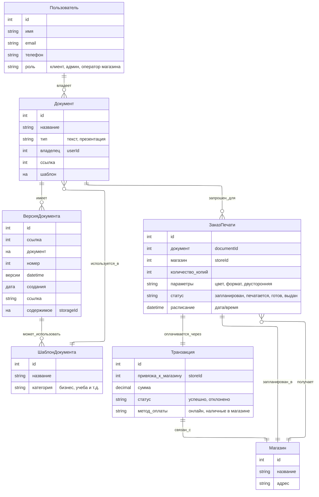
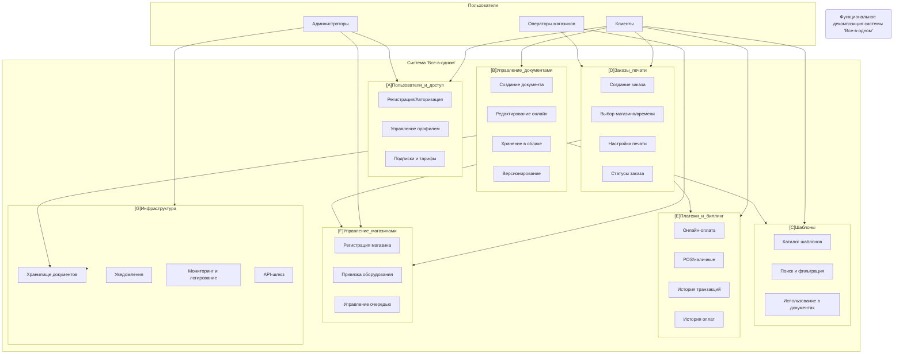

## You Look Good In Print

## Модели предметной области
- принимаем ADR об инструменте для составления диаграмм моделей предметной области
[0008-use-mermaid-entity-relationship-diagram-for-domain-modeling.md](architecture/decisions/0008-use-mermaid-entity-relationship-diagram-for-domain-modeling.md)

- Получаем диаграмму моделей предметной области

Основные связи:
- Пользователь → Документы (многие)
- Документ → Версии (многие)
- Документ → ЗаказПечати (многие)
- ЗаказПечати → Транзакция (1..1)
- ЗаказПечати → Магазин (1..1)
- Шаблон → используется в Документах

## Функциональная декомпозиция
- принимаем ADR об инструменте для составления диаграмм функциональной декомпозии
[0009-use-mermaid-flowcharts-for-functional-decomposition.md](architecture/decisions/0009-use-mermaid-flowcharts-for-functional-decomposition.md)
- Получаем диаграмму функциональной декомпозии

Разделим систему на подсистемы/сервисы:

A. Пользователи и доступ

- Регистрация / авторизация (OAuth, соцсети, email+пароль)
- Управление профилем
- Управление подписками и тарифами

B. Управление документами
- Создание документа (с нуля или из шаблона)
- Редактирование (онлайн редактор текста/презентаций)
- Хранение в облаке
- Версионирование (история изменений, откат)
- Совместный доступ (опционально)

C. Шаблоны
- Каталог шаблонов
- Поиск и фильтрация
- Использование как стартовой точки

D. Заказы печати
- Формирование заказа
- Выбор магазина и времени
- Настройки печати (цвет, двусторонняя, формат бумаги)
- Управление статусами заказа
- Интеграция с системой печати магазина

E. Платежи и биллинг
- Онлайн-оплата (карты, Apple Pay/Google Pay)
- Оплата в магазине (POS-терминал, наличные)
- Управление транзакциями
- История оплат

F. Управление магазинами
- Регистрация и настройка магазинов
- Привязка оборудования печати
- Управление очередью заказов

G. Инфраструктура
- Хранилище документов (S3 или аналог)
- Логирование и мониторинг
- Система уведомлений (email, push, SMS)
- API-шлюзы для интеграции
