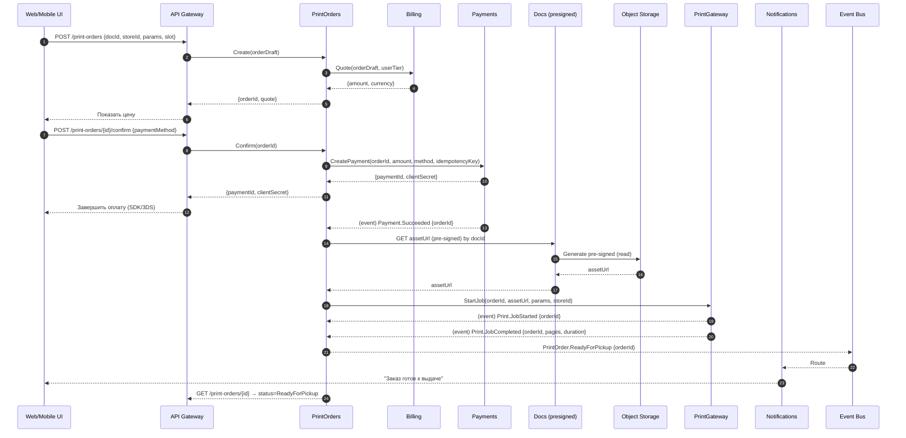

## You Look Good In Print

### 1. Сервис **PrintOrders** (заказы на печать).

 Что делает PrintOrders

* Принимает/хранит заказы печати, параметры (цвет, двусторонняя, формат), слот времени и магазин.
* Считает цену (через сервис Billing), инициирует оплату (через сервис Payments).
* После оплаты отправляет задание в печать (через сервис PrintGateway) и отслеживает статусы.
* Шлёт события для уведомлений и аналитики.

---

# Взаимодействие (критичный сценарий: «Оформление и выполнение заказа»)

---

# Оценка архитектурного решения (по атрибутам качества)

## 1) Надёжность / согласованность

* **Сценарий:** платёж прошёл, а отправка в печать временно недоступна.
* **Механизмы:** outbox + ретраи; оркестрация саги (статусы: `Paid → Dispatching → Printing → Ready`); идемпотентные команды `StartJob(orderId)`.
* **Ожидаемо:** не теряем оплаченные заказы;
* **Риск:** двойной запуск печати при повторах → **идемпотентность по orderId** на стороне PrintGateway.

## 2) Доступность

* **Сценарий:** недоступен Billing или Payments.
* **Механизмы:** circuit breaker + graceful degradation (можно сохранить **draft** заказа без оплаты); DLQ для событий.
* **Ожидаемо:** создание draft работает (99.95%), подтверждение ждёт восстановления провайдера; заказы не теряются.

## 3) Производительность

* **Сценарий:** пользователь получает котировку и подтверждает заказ.
* **Механизмы:** синхронный вызов Quote; все тяжёлые операции (печать, вебхуки) асинхронно.
* **Метрики:** `Create→Quote` ≤ **300 мс**; `Confirm` (инициация платежа) ≤ **500 мс**; UI получает статус в реальном времени по событиям.

## 4) Масштабируемость

* **Сценарий:** всплеск 10× (сессии экзаменов).
* **Механизмы:** горизонтальный скейл; Kafka/NATS для событий; PrintGateway шардируется по магазинам.
* **Метрики:** удерживаем ≥ **500 rps** на Create/Confirm при линейном скейле; 

## 5) Модифицируемость

* **Сценарий:** добавить новый параметр печати (например, скрепление/степлер) и новый тип устройства.
* **Механизмы:** декларативная модель параметров (schema/JSON) в Print Orders Service; **PrintGateway = набор адаптеров** (Adapter pattern).
* **Ожидаемо:** изменение без каскада по системе; TTM фичи ≤ **2 недели**; затрагиваются Print Orders Service DTO + один адаптер PG.

## 6) Безопасность

* **Сценарий:** злоумышленник пытается переиспользовать `assetUrl`.
* **Механизмы:** короткий TTL presigned, строгое соответствие `orderId↔docId` (Print Orders Service валидирует), PrintGateway скачивает по серверной сети (без утечки в интернет).
* **Метрики:** 0 успешных неавторизованных скачиваний; время ротации ключей PrintGateway ≤ **24 ч**.

## 7) Наблюдаемость/диагностика

* **Сценарий:** часть заказов «застряла» между Paid и Printing.
* **Механизмы:** сквозной traceId; бизнес-SLI: **time-to-first-page**, **pay→start**, **fail ratio**; алерты на превышение порогов.
* **Метрики:** MTTR (Mean Time To Repair / Restore / Recovery) инцидента ≤ **30 мин**; доля «застрявших» < **0.2%**; авто-ретраи с джиттером.
  
Основные бизнес-SLI в контексте печати

| Метрика                | Расшифровка / Что измеряет                                                          | Почему важна                                                                                     |
| ---------------------- | ----------------------------------------------------------------------------------- | ------------------------------------------------------------------------------------------------ |
| **time-to-first-page** | Время от начала печати до выхода первой страницы из принтера                        | Показывает фактическую скорость и отзывчивость сервиса печати (влияет на клиентский UX).         |
| **pay→start**          | Время от момента успешной оплаты до начала печати                                   | Отражает, насколько быстро система передаёт задание на принтер (оперативность цепочки ORD → PG). |
| **fail ratio**         | Доля неудачных заказов (ошибки печати, отмены, сбои оплаты) от общего числа заказов | Измеряет надёжность и устойчивость бизнес-процесса.                                              |

---

# Сильные стороны решения

* Чёткое разделение ответственности: расчёт/оплата отделены от печати; тяжёлый контент идёт минуя Print Orders Service.
* Устойчивость к сбоям за счёт событийной модели, outbox и идемпотентности.
* Хорошая модифицируемость через адаптеры PrintGateway и схему параметров.

# Зоны риска и как смягчить

* **Зависимость от внешних провайдеров** (Payments/Billing)
* **Дублирование печати** при повторах: строгая идемпотентность в PrintGateway и блокировка по `orderId`.
* **Edge-безопасность presigned URL**: короткие TTL, скачивание только сервером PrintGateway, одноразовые ссылки.
