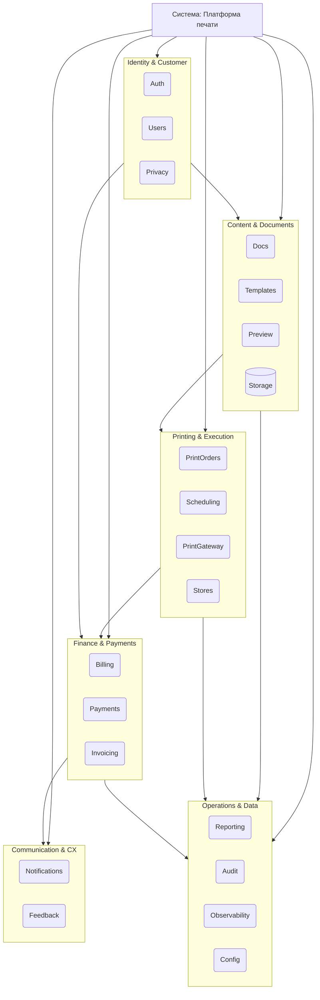
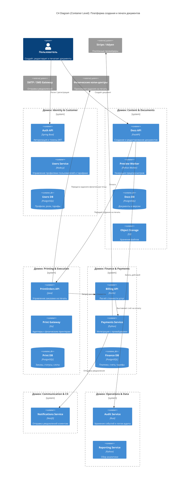
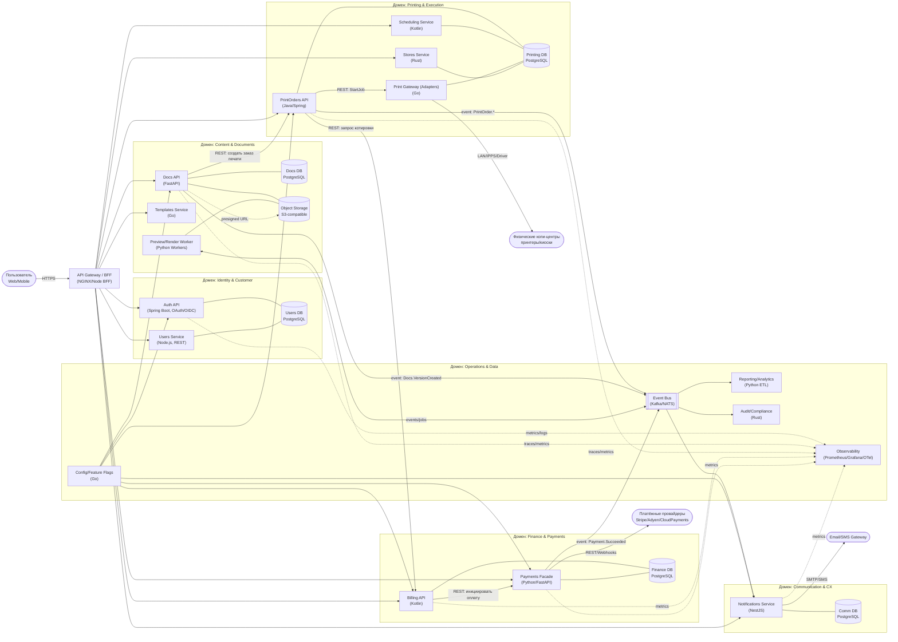
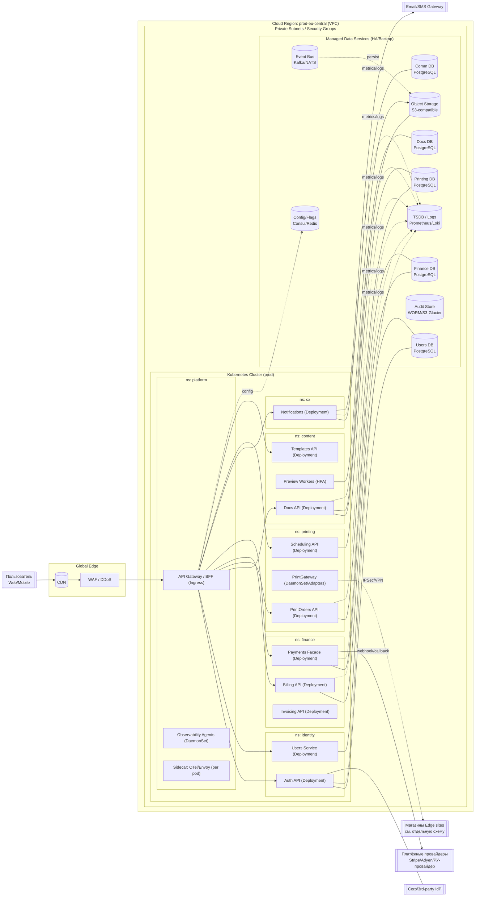
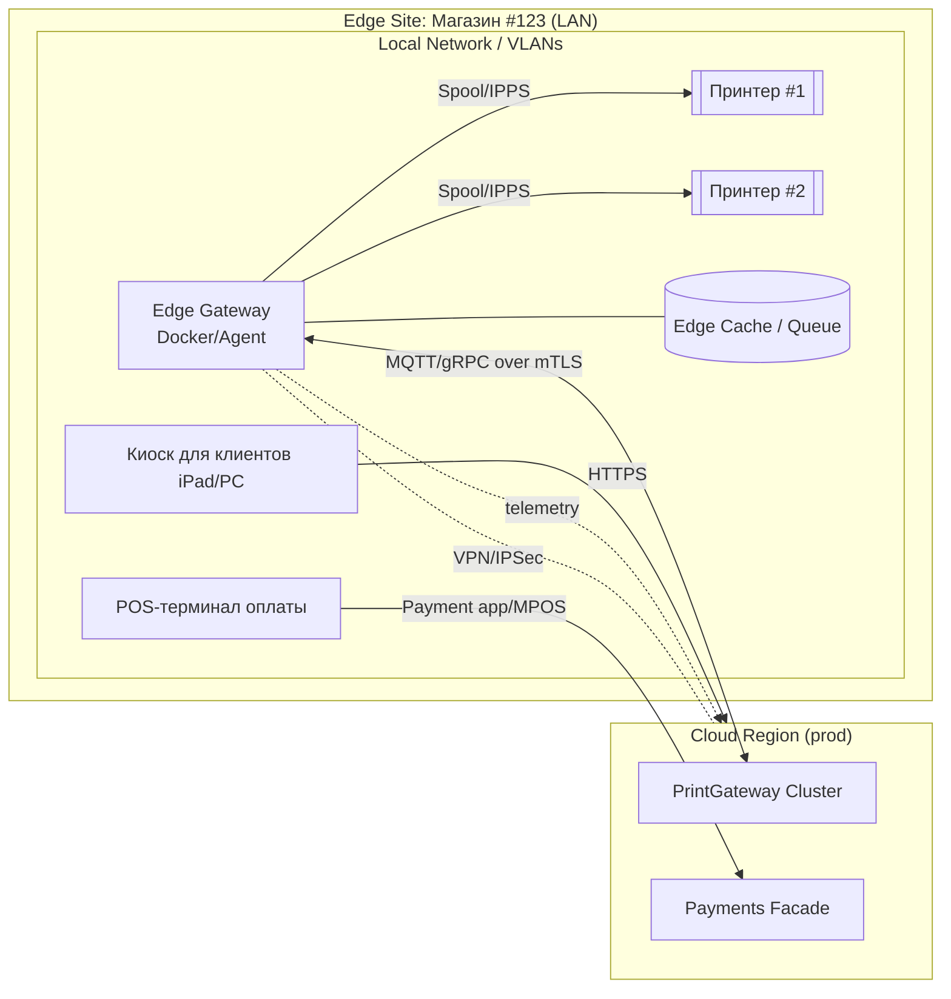

## 1. Модель функциональной декомпозиции
Выбор модели функциональной декомпозиции — Service-Oriented Architecture (SOA) зафиксирован в 
[ADR-10](architecture/decisions/0010-service-oriented-architecture.md)

## 2. Доменные границы и сервисы 
Доменные границы и сервисы определены в [ADR-11](architecture/decisions/0011-domain-boundaries-and-services.md)

### 2.1 Каталог доменов и сервисов
| Домен                    | Сервисы                                                             | Основные сущности (SSOT)                      | Бизнес-цель                          |  Владелец                          |
| ------------------------ | ------------------------------------------------------------------- | --------------------------------------------- | ------------------------------------ |------------------------------------|
| **Identity & Customer**  | Auth, Users, Privacy                                                | User, Role, Session, Plan, Consent            | Безопасность, персонализация         |  Team Identity                     |
| **Content & Documents**  | Templates, Docs, Preview/Render, Storage (абстракция)               | Template, Document, Version, Preview, BlobRef | Создание/редактирование/хранение     |  Team Content                      |
| **Printing & Execution** | PrintOrders, Scheduling, Stores, PrintGateway                       | PrintOrder, Job, Slot, Store, Device          | Выполнение печати                    |  Team Print                        |
| **Finance & Payments**   | Billing, Payments, Invoicing                                        | Quote, Tariff, Payment, Subscription, Invoice | Монетизация, расчёты                 |  Team Finance                      |
| **Communication & CX**   | Notifications, Feedback                                             | Notification, Channel, Template, Feedback     | Своеврем. коммуникация, NPS          |  Team CX                           |
| **Operations & Data**    | Reporting, Audit/Compliance, Observability, Config/Flags, OpsBridge | AuditEvent, Metric, Report, Flag              | Управляемость, комплаенс, интеграции |  Team Platform                     |

### 2.2 Связи между доменами
| Источник                    | Цель                           | Тип взаимодействия | Пример                    |
| --------------------------- | ------------------------------ | ------------------ | ------------------------- |
| **Content → Printing**      | Передача документа на печать   | API (sync)         | Создание заказа на печать |
| **Printing → Finance**      | Инициация оплаты               | API (sync)         | Оплата печати             |
| **Finance → Communication** | Отправка уведомления об оплате | Event (async)      | Пуш-уведомление           |
| **Content → Operations**    | Логирование изменений          | Event (async)      | Аналитика                 |
| **Identity → Finance**      | Проверка тарифа/лимита         | API (sync)         | Расчёт цены               |
| **Operations → All**        | Сбор метрик, аудит             | Event consumer     | Наблюдаемость             |

### 2.3 Диаграмма иерархии уровней

## 3. Диаграмма C4 (Container level)

### 3.1. C4 Container Diagram с доменами (верхнеуровнево)

### 3.2. C4 (Container level) сервисы, технологии и ключевые взаимодействия

## 4. Декомпозиция слоя данных: какие данные в каких БД хранятся

| Домен/Сервис           | Тип БД/Хранилище      | Что хранится                                 |
| ---------------------- |-----------------------| -------------------------------------------- |
| Auth/Users             | PostgreSQL, Redis     | учётки, профили, планы; сессии/блок-листы    |
| Docs                   | PostgreSQL            | метаданные документов/версий/шаринга         |
| Docs Blobs             | S3                    | двоичные данные версий, предпросмотры        |
| Templates              | PostgreSQL + S3       | метаданные и артефакты шаблонов              |
| Search                 | OpenSearch            | полнотекст по документам                     |
| PrintOrders/Jobs/Slots | PostgreSQL            | заказы, задания, расписания, устройства      |
| Device telemetry       | Timescale/ClickHouse  | метрики принтеров (TS)                       |
| Billing/Payments       | PostgreSQL            | тарифы, котировки, статусы платежей, инвойсы |
| Reconciliation         | S3                    | отчёты провайдера, свёрка                    |
| Notifications/Feedback | PostgreSQL, Redis     | сообщения, шаблоны, скоринг, квоты           |
| Event Bus              | Kafka/NATS            | доменные события (ретенция)                  |
| Warehouse              | ClickHouse/Snowflake  | аналитика и отчётность (факты/измерения)     |
| Audit/Compliance       | S3 (WORM), OpenSearch | неизменяемый аудит, поисковый индекс         |
| Observability          | Prometheus/Loki/Tempo | метрики, логи, трейсы                        |
| Config/Flags           | Consul/Postgres       | конфигурации и фичефлаги                     |

## 5. Деплоймент диаграмма
### 5.1. Прод: облако + регионы + внешние системы

### 5.2. Магазин (edge site): печать и связь с продом

>Локальный агент в магазине (GWEDGE)
поддерживает защищённое (mTLS) соединение с облачным шлюзом печати (PG)
и обменивается данными через протоколы MQTT и gRPC.
>
>Через это соединение облако отправляет задания на печать,
а агент передаёт статусы и метрики принтеров.
